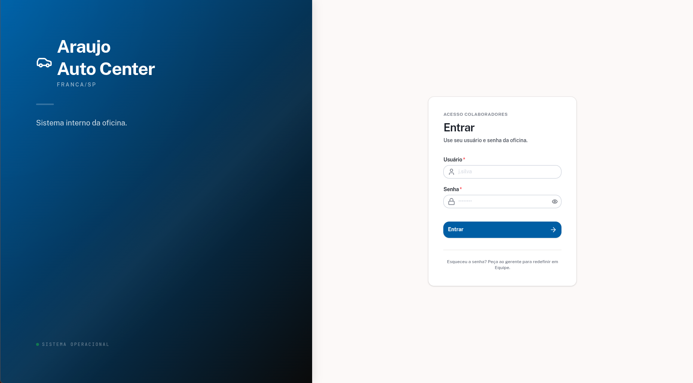
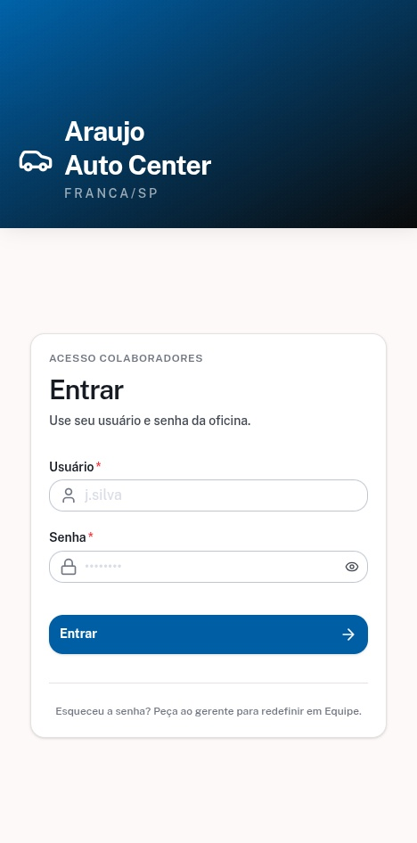
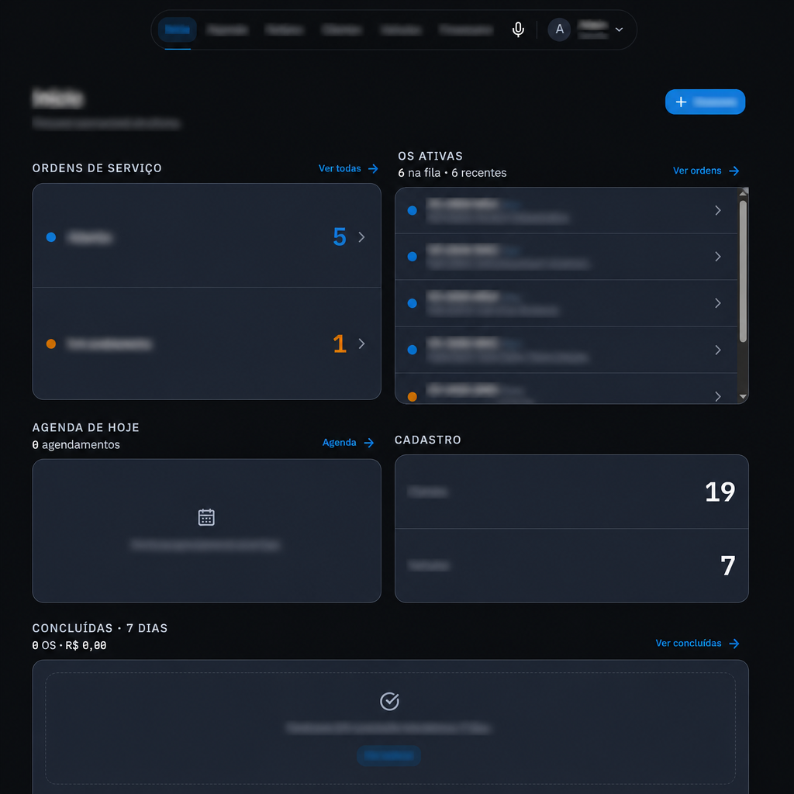
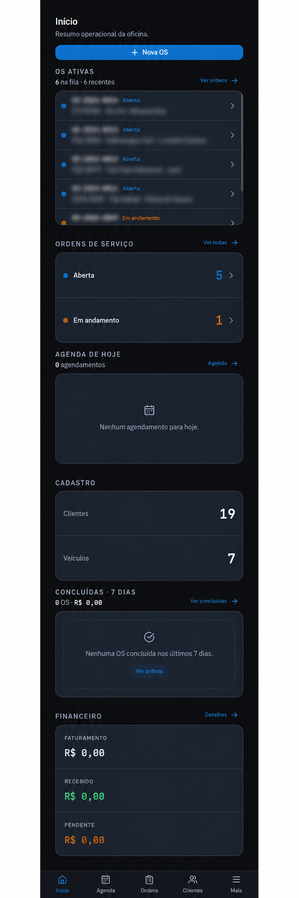
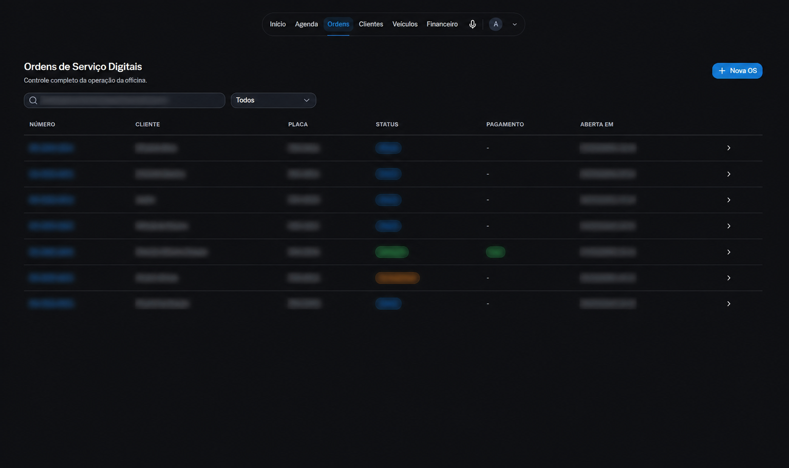
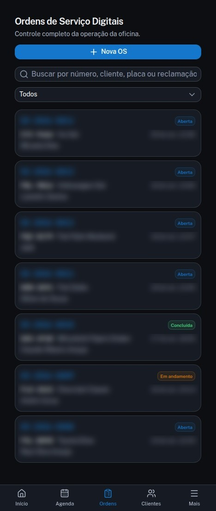
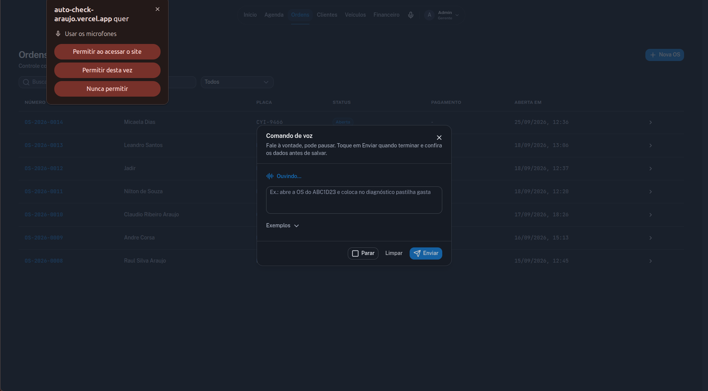
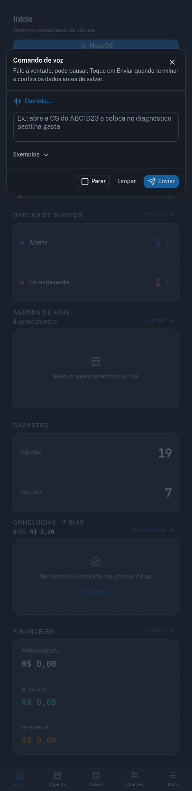

# Auto Check Araujo

Sistema interno da oficina mecânica — MVP de **Clientes** e **Veículos** (uso exclusivo de Colaboradores).

Stack: Nuxt 4, Nuxt UI, Supabase (Auth + Postgres + RLS).

## Telas

| Tela | Desktop | Mobile |
|------|---------|--------|
| Login |  |  |
| Dashboard |  |  |
| Ordem de Serviço |  |  |
| Comandos de voz |  |  |

## Setup

### 1. Dependências

```bash
pnpm install
```

### 2. Supabase (remoto)

Projeto: `auto-check-araujo` (`afvtakijrfalpdtmbjdt`, região `sa-east-1`).

```bash
cp .env.example .env
```

Preencha:

- `NUXT_PUBLIC_SUPABASE_URL`
- `NUXT_PUBLIC_SUPABASE_KEY` (anon key)

Schema (`profiles`, `clientes`, `veiculos` + RLS) já aplicado no remoto.

### 3. Criar um Colaborador

No [Studio](https://supabase.com/dashboard/project/afvtakijrfalpdtmbjdt/auth/users) → Authentication → Users → Add user (e-mail e senha).  
O trigger cria o registro em `profiles` automaticamente.

**Configurações de Auth recomendadas (Dashboard → Authentication → Settings):**

- **Disable signup** — app interno; colaboradores são criados manualmente no Studio
- **Leaked password protection** — ativar (HaveIBeenPwned)
- **Confirm email** — desativar em dev se quiser login imediato

### 4. App

```bash
pnpm dev
```

Abra `http://localhost:3000` — redireciona para `/login` ou `/app`.

## Rotas

| Rota | Descrição |
|------|-----------|
| `/login` | Entrada do Colaborador |
| `/app` | Resumo (totais) |
| `/app/clientes` | Lista / busca |
| `/app/clientes/novo` | Cadastro |
| `/app/clientes/[id]` | Detalhe, edição e Veículos do Cliente |
| `/app/veiculos` | Lista / busca por placa |
| `/app/veiculos/novo` | Cadastro (vinculado a Cliente) |
| `/app/veiculos/[id]` | Detalhe, edição e OS do Veículo |
| `/app/ordens` | Lista / filtro de Ordens de Serviço |
| `/app/ordens/novo` | Abrir OS |
| `/app/ordens/[id]` | Detalhe, status, diagnóstico e orçamento |

## Domínio

Ver [CONTEXT.md](./CONTEXT.md).

## Scripts

```bash
pnpm dev        # desenvolvimento
pnpm build      # produção
pnpm lint       # ESLint
pnpm typecheck  # TypeScript
```
